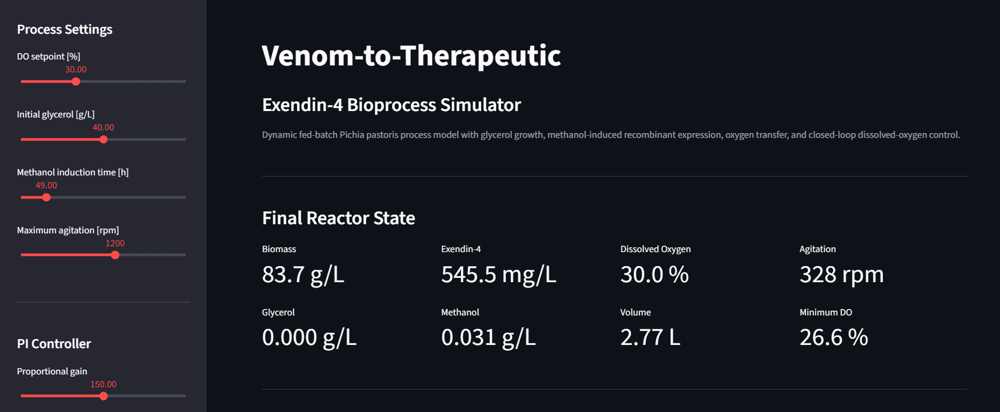

<div align="center">

# Venom-to-Therapeutic

### Exendin-4 Bioprocess Simulator v1.0

Dynamic fed-batch modeling of recombinant Exendin-4 production in *Pichia pastoris*, with oxygen-transfer limitations and closed-loop dissolved-oxygen control.
[Launch Interactive Simulator](https://exendin-4-bioprocess-simulator.streamlit.app/)

**Python · SciPy · Streamlit · Bioprocess Engineering · Process Control**

</div>



---

## Why I Built This

Venom-derived molecules have led to important therapeutics in medicine, but direct venom collection from animals presents challenges in welfare, supply, reproducibility, and scale-up.

Moreover, after writing a research paper on this topic, I began this project after asking the question:

> **How could recombinant biomanufacturing help produce a venom-derived therapeutic peptide without relying on direct venom extraction?**

I chose **Exendin-4**, a peptide originally isolated from the Gila monster and later developed into the basis for exenatide, as a case study.

The goal of this project is not to claim that recombinant production automatically makes these drugs cheaper. Instead, it explores one part of that challenge: designing a scalable and controllable fermentation process that could support more reproducible manufacturing.

[Read the research essay that motivated this project](docs/A_Deadly_Cure.pdf)

---

```markdown
## Process Overview

```mermaid
flowchart LR

    subgraph BIO["Bioprocess"]
        A["1. Glycerol batch<br/>Build biomass"]
        B["2. Glycerol fed-batch<br/>Increase cell density"]
        C["3. Transition<br/>Deplete residual glycerol"]
        D["4. Methanol induction<br/>Activate AOX1 expression"]
        E["5. Exendin-4 production"]

        A --> B --> C --> D --> E
    end

    subgraph CTRL["Dissolved-Oxygen Control"]
        F["Dissolved O₂<br/>DO sensor"]
        G["PI controller"]
        H["Agitation<br/>RPM"]
        I["Oxygen-transfer capacity<br/>kLa"]
        J["Oxygen transfer<br/>OTR"]

        F -->|"DO below setpoint"| G
        G -->|"RPM command"| H
        H -->|"changes mixing"| I
        I -->|"controls O₂ transfer rate"| J
        J -->|"changes dissolved O₂"| F
    end

The model tracks:

| State | Description |
|---|---|
| $X$ | Biomass concentration |
| $G$ | Glycerol concentration |
| $M$ | Methanol concentration |
| $P$ | Exendin-4 fusion-protein concentration |
| $C_L$ | Dissolved oxygen |
| $V$ | Reactor volume |

---

## Model

### Growth and feeding

Glycerol-supported growth is modeled using Monod kinetics:

$$
\mu_G =
\mu_{G,\max}
\frac{G}{K_G + G}
$$

Methanol metabolism includes substrate inhibition:

$$
\mu_M =
\mu_{M,\max}
\frac{M}
{K_M + M + M^2/K_I}
$$

The process begins with glycerol growth, transitions to fed-batch biomass accumulation, and then switches to methanol feeding to induce recombinant expression.

### Oxygen transfer

Cellular oxygen demand competes with oxygen transfer into the broth:

$$
OTR = k_La(C^* - C_L)
$$

$$
\frac{dC_L}{dt} = OTR - OUR
$$

When oxygen becomes limiting, the effective microbial growth rate decreases.

### Dissolved-oxygen control

A PI controller adjusts agitation to maintain the requested dissolved-oxygen setpoint:

$$
N =
N_0 +
K_P e(t) +
K_I \int e(t)\,dt
$$

where:

$$
e(t) = DO_{SP} - DO(t)
$$

Agitation changes the oxygen-transfer coefficient:

$$
k_La =
k_{La,\mathrm{ref}}
\left(
\frac{N}{N_{\mathrm{ref}}}
\right)^a
$$

Physical RPM limits and integral anti-windup are included.

---

## Baseline Result

With the default operating conditions:

| Metric | Result |
|---|---:|
| Final biomass | 84.6 g/L |
| Exendin-4 fusion protein | 556.5 mg/L |
| Final dissolved oxygen | 30.0% |
| Minimum dissolved oxygen | 26.6% |
| Final agitation | 331 rpm |
| Maximum agitation | 995 rpm |
| Final volume | 2.78 L |
| Final product mass | 1.55 g |

The recombinant-product parameter was calibrated against a reported Exendin-4 fusion-protein expression level of approximately **580 mg/L**. The simulated 556.5 mg/L result should therefore not be treated as independent validation.

---

## Interactive Simulator

The Streamlit interface lets the user change:

- dissolved-oxygen setpoint
- initial glycerol concentration
- methanol induction time
- maximum agitation speed
- PI proportional gain
- PI integral gain

The complete dynamic model is recalculated after each change.

This makes it possible to explore questions such as:

- What happens when oxygen-transfer capacity is restricted?
- How does induction timing affect product titre?
- How much agitation is required as biomass increases?
- What happens when the PI controller is poorly tuned?

<!-- Add this after deployment:
[Launch the live simulator](YOUR_STREAMLIT_URL)
-->

---

## Parameter Basis

The model combines literature values with engineering assumptions and calibrated parameters.

| Parameter | Value | Basis |
|---|---:|---|
| Initial glycerol | 40 g/L | Literature process condition |
| $\mu_{G,\max}$ | 0.177 h⁻¹ | *P. pastoris* growth data |
| $Y_{X/G}$ | 0.40 g/g | Literature-based process model |
| $Y_{X/M}$ | 0.55 g/g | Literature-based process model |
| Glycerol feed | 1260 g/L | Published feeding strategy |
| Glycerol target $\mu$ | 0.14 h⁻¹ | Published feeding strategy |
| Methanol target $\mu$ | 0.015 h⁻¹ | Representative fed-batch condition |
| $\mu_{M,\max}$ | 0.070 h⁻¹ | Representative Mut+ value |
| Methanol inhibition region | ~3.65 g/L | Published growth study |
| Glycerol $q_{O_2}$ | ~2.2 mmol/(g·h) | Literature oxygen-uptake data |
| Methanol $q_{O_2}$ | ~1.7 mmol/(g·h) | Literature oxygen-uptake data |
| Exendin-4 target | ~580 mg/L | Recombinant expression study |
| Product coefficient | calibrated | Model calibration |
| PI gains | tuned | Controller tuning |
| $k_La$ correlation | assumed | Engineering model |

Parameters taken from other *P. pastoris* processes are treated as representative values rather than measurements from the exact Exendin-4 production strain.

---

## Sources

1. **Zhou et al.**  
   *Purification and bioactivity of exendin-4, a peptide analogue of GLP-1, expressed in Pichia pastoris.*  
   Biotechnology Letters, 2008.  
   DOI: `10.1007/s10529-007-9610-4`

2. **Zhang et al.**  
   *Pichia pastoris fermentation with mixed-feeds of glycerol and methanol: growth kinetics and production improvement.*  
   Journal of Industrial Microbiology and Biotechnology, 2003.  
   DOI: `10.1007/s10295-003-0035-3`

3. **Boojari et al.**  
   *Developing a metabolic model-based fed-batch feeding strategy for Pichia pastoris fermentation through fine-tuning of the methanol utilization pathway.*  
   Microbial Biotechnology, 2023.  
   DOI: `10.1111/1751-7915.14264`

4. **Lopes et al.**  
   *Batch and fed-batch growth of Pichia pastoris under increased air pressure.*  
   Bioprocess and Biosystems Engineering, 2013.  
   DOI: `10.1007/s00449-012-0871-5`

5. **PubChem — Methanol, CID 887**  
   Used for the approximate density of pure methanol.

---

## Limitations

- pH or temperature dynamics
- airflow or oxygen enrichment control
- detailed intracellular metabolism
- product-quality attributes
- downstream purification
- regulatory constraints

A particularly relevant future extension would be a **cost-of-goods model** connecting titre, productivity, oxygen demand, purification yield, and batch time to manufacturing cost.

---

## Run Locally

Install the required packages:

```bash
python -m pip install -r requirements.txt
```

Run the simulator:

```bash
python -m streamlit run dashboard.py
```

---

## Project Structure

```text
exendin-4-bioprocess-simulator/
├── dashboard.py
├── model.py
├── requirements.txt
├── README.md
├── docs/
│   └── A_Deadly_Cure.pdf
└── Images/
    └── dashboard.png
```

---
