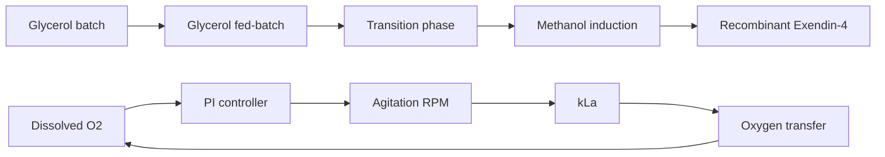

<div align="center">

# Venom-to-Therapeutic

### Exendin-4 Bioprocess Simulator

**A dynamic fed-batch model of recombinant Exendin-4 production in *Pichia pastoris***

Python · SciPy · Streamlit · Bioprocess Engineering · Process Control

</div>


> [!NOTE]
> This project is a literature-informed engineering simulator. It is not a validated pharmaceutical manufacturing model and should not be interpreted as one.

---

## Why I Built This

Venom-derived peptides have demonstrated remarkable therapeutic potential, but translating naturally occurring toxins into accessible medicines presents challenges in animal welfare, material supply, reproducibility, scale-up, purification and manufacturing.

This project grew out of my research into those challenges and asks a narrower engineering question:

> **How could a recombinant bioprocess be modeled and controlled to produce a venom-derived therapeutic peptide without depending on direct venom extraction?**

Exendin-4 was selected as the case study. Originally isolated from the Gila monster (*Heloderma suspectum*), Exendin-4 inspired the GLP-1 receptor agonist exenatide and has also been recombinantly expressed using *Pichia pastoris*.

The simulator explores the manufacturing side of that problem: microbial growth, carbon-source feeding, methanol induction, oxygen-transfer limitations and closed-loop process control.

My broader motivation is to explore engineering approaches that could make venom-inspired therapeutics more reproducible, scalable and ultimately more accessible.

[Read the research essay that motivated this project](docs/A_Deadly_Cure.pdf)

---

## Process Overview



The model tracks six coupled reactor states:

\[
\mathbf{y} =
\begin{bmatrix}
X & G & M & P & C_L & V
\end{bmatrix}^{T}
\]

where:

| Symbol | State | Unit |
|---|---|---|
| \(X\) | Biomass concentration | g/L |
| \(G\) | Glycerol concentration | g/L |
| \(M\) | Methanol concentration | g/L |
| \(P\) | Exendin-4 fusion protein | mg/L |
| \(C_L\) | Dissolved oxygen concentration | mmol/L |
| \(V\) | Reactor volume | L |

---

## Model Components

### Glycerol Growth

Glycerol-supported growth is represented using Monod kinetics:

\[
\mu_G =
\mu_{G,\max}
\frac{G}{K_G + G}
\]

Glycerol is used first for biomass accumulation before recombinant expression begins.

### Methanol Growth and Inhibition

Methanol serves as both carbon source and inducer of the AOX1 expression system.

A substrate-inhibition model is used:

\[
\mu_M =
\mu_{M,\max}
\frac{M}
{K_M + M + M^2/K_I}
\]

This captures the fact that excessive residual methanol can inhibit *P. pastoris* growth.

### Fed-Batch Mass Balances

Feed flow changes reactor volume:

\[
\frac{dV}{dt}=F
\]

and introduces dilution:

\[
D=\frac{F}{V}
\]

The biomass balance is therefore of the form:

\[
\frac{dX}{dt}
=
(\mu_G+\mu_M-k_d-D)X
\]

Separate glycerol and methanol balances account for substrate addition, consumption and dilution.

### Recombinant Product Formation

Exendin-4 production is activated during the methanol-induction phase.

Product formation is coupled to methanol utilization and reduced in the presence of residual glycerol to represent AOX1 repression.

The resulting product balance includes production, dilution and degradation:

\[
\frac{dP}{dt}
=
q_PX-DP-k_PP
\]

---

## Oxygen Transfer

The simulator explicitly couples biological oxygen demand to gas-liquid oxygen transfer.

\[
OTR=k_La(C^*-C_L)
\]

and

\[
\frac{dC_L}{dt}=OTR-OUR
\]

where:

- \(OTR\) is the oxygen transfer rate
- \(OUR\) is the cellular oxygen uptake rate
- \(k_La\) is the volumetric mass-transfer coefficient
- \(C^*\) is the saturation oxygen concentration

Growth is also reduced when dissolved oxygen becomes limiting.

---

## Closed-Loop DO Control

Agitation is manipulated using a PI controller to maintain dissolved oxygen near its setpoint:

\[
e(t)=DO_{SP}-DO(t)
\]

\[
N=N_0+K_Pe(t)+K_I\int e(t)\,dt
\]

Agitation affects oxygen transfer through:

\[
k_La =
k_{La,\mathrm{ref}}
\left(
\frac{N}{N_{\mathrm{ref}}}
\right)^a
\]

The controller includes:

- physical agitation limits
- integral anti-windup
- dynamic oxygen-transfer response

---

## Baseline Simulation

With the baseline settings:

| Metric | Result |
|---|---:|
| Final biomass | 84.6 g/L |
| Exendin-4 fusion protein | 556.5 mg/L |
| Final dissolved oxygen | 30.0% |
| Minimum dissolved oxygen | 26.6% |
| Final agitation | 331 rpm |
| Maximum agitation | 995 rpm |
| Final reactor volume | 2.78 L |
| Final product mass | 1.55 g |

The recombinant-product parameter was calibrated against a reported Exendin-4 fusion-protein expression level of approximately **580 mg/L**. The 556.5 mg/L baseline result is therefore not an independent validation result.

---

## Interactive Simulator

The Streamlit interface allows the user to change:

- dissolved-oxygen setpoint
- initial glycerol concentration
- methanol induction time
- maximum agitation speed
- PI proportional gain
- PI integral gain

Each change reruns the complete dynamic bioreactor simulation.

This makes it possible to explore questions such as:

- What happens when oxygen-transfer capacity is restricted?
- How does induction timing affect final product titre?
- How aggressively must agitation respond to increasing oxygen demand?
- What happens when the PI controller is poorly tuned?

---

## Parameter Provenance

Not every model parameter is equally well established. Literature-derived, representative, assumed and calibrated parameters are deliberately distinguished below.

| Parameter | Value | Basis |
|---|---:|---|
| Initial glycerol | 40 g/L | Literature process condition [2] |
| Initial working volume | 2 L | Literature process condition [2], [3] |
| \(\mu_{G,\max}\) | 0.177 h\(^{-1}\) | Experimental *P. pastoris* growth value [2] |
| \(Y_{X/G}\) | 0.40 g/g | Literature fed-batch assumption [3] |
| \(Y_{X/M}\) | 0.55 g/g | Literature fed-batch assumption [3] |
| Glycerol feed concentration | 1260 g/L | Literature feeding strategy [3] |
| Glycerol target growth rate | 0.14 h\(^{-1}\) | Literature feeding strategy [3] |
| Methanol target growth rate | 0.015 h\(^{-1}\) | Literature fed-batch strategy [2] |
| Representative \(\mu_{M,\max}\) | 0.070 h\(^{-1}\) | Representative Mut+ literature value [2] |
| Methanol inhibition region | 3.65 g/L | Literature growth model [2] |
| Pure-methanol feed density | ~792 g/L | Methanol physical property [5] |
| Glycerol \(q_{O_2}\) | ~2.2 mmol/(g·h) | Converted from ~70 mg O2/(g·h) [4] |
| Methanol \(q_{O_2}\) | ~1.7 mmol/(g·h) | Converted from ~53 mg O2/(g·h) [4] |
| Exendin-4 calibration target | ~580 mg/L | Recombinant expression experiment [1] |
| Product yield coefficient | 4.70 mg/g | Calibrated model parameter |
| \(K_G\), \(K_M\), \(K_O\) | model values | Engineering assumptions |
| \(k_d\), \(k_P\) | model values | Engineering assumptions |
| \(k_La\) reference and RPM exponent | model values | Engineering assumptions |
| PI gains | tuned numerically | Controller tuning |
| RPM limits | process assumptions | User-defined equipment constraints |

This provenance table is important: values taken from another recombinant *Pichia* process are treated as representative parameters rather than as measurements from the exact Exendin-4 strain.

---

## Literature Basis

**[1] Zhou, J., Chu, J., Wang, Y.-H., Wang, H., Zhuang, Y.-P., & Zhang, S.-L.**  
*Purification and bioactivity of exendin-4, a peptide analogue of GLP-1, expressed in Pichia pastoris.*  
Biotechnology Letters, 30, 651–656.  
doi: **10.1007/s10529-007-9610-4**

Used for the recombinant *P. pastoris* Exendin-4 system and the reported fusion-protein expression level of approximately 580 mg/L.

**[2] Zhang, W., Potter, K. J. H., Plantz, B. A., Schlegel, V. L., Smith, L. A., & Meagher, M. M.**  
*Pichia pastoris fermentation with mixed-feeds of glycerol and methanol: growth kinetics and production improvement.*  
Journal of Industrial Microbiology and Biotechnology, 30, 210–215.  
doi: **10.1007/s10295-003-0035-3**

Used for glycerol growth kinetics, initial glycerol conditions, methanol-growth behavior, methanol inhibition and representative fed-batch growth targets.

**[3] Boojari, M. A., Rajabi Ghaledari, F., Motamedian, E., Soleimani, M., & Shojaosadati, S. A.**  
*Developing a metabolic model-based fed-batch feeding strategy for Pichia pastoris fermentation through fine-tuning of the methanol utilization pathway.*  
Microbial Biotechnology, 16, 1344–1359.  
doi: **10.1111/1751-7915.14264**

Used for biomass-yield assumptions and the model-based glycerol feeding strategy.

**[4] Lopes, M., Belo, I., & Mota, M.**  
*Batch and fed-batch growth of Pichia pastoris under increased air pressure.*  
Bioprocess and Biosystems Engineering, 36, 1267–1275.  
doi: **10.1007/s00449-012-0871-5**

Used for representative specific oxygen-uptake rates on glycerol and methanol.

**[5] PubChem — Methanol, CID 887.**

Used for the approximate density of pure methanol used to convert volumetric methanol feed into mass concentration.

---

## Assumptions and Limitations

This simulator is intentionally more detailed than a basic Monod-growth model, but it remains a reduced-order engineering representation.

Not currently modeled:

- temperature dynamics
- pH dynamics
- airflow or oxygen enrichment as manipulated variables
- detailed intracellular metabolism
- proteolytic degradation pathways
- strain-specific parameter estimation
- sensor noise and delay
- downstream purification
- product quality attributes
- capital or operating costs
- regulatory manufacturing constraints

Because purification yield and manufacturing economics are not included, the model **does not demonstrate that recombinant Exendin-4 would be cheaper to manufacture**.

A future extension could couple the process simulation to a cost-of-goods model to investigate whether improved titre, oxygen-transfer efficiency and batch productivity translate into lower manufacturing cost.

---

## Project Structure

```text
bioreactor-digital-twin/
├── dashboard.py
├── model.py
├── requirements.txt
├── README.md
├── docs/
│   └── A_Deadly_Cure.pdf
└── Images/
    └── dashboard.png
```

`model.py` contains the dynamic process model and simulation engine.

`dashboard.py` contains the interactive Streamlit interface.

---

## Run Locally

Create a virtual environment and install the dependencies:

```bash
python -m pip install -r requirements.txt
```

Launch the simulator:

```bash
python -m streamlit run dashboard.py
```

---

## Disclaimer

This project is an educational and engineering modeling exercise. It is not intended for clinical use, pharmaceutical process design, manufacturing decisions or medical guidance.